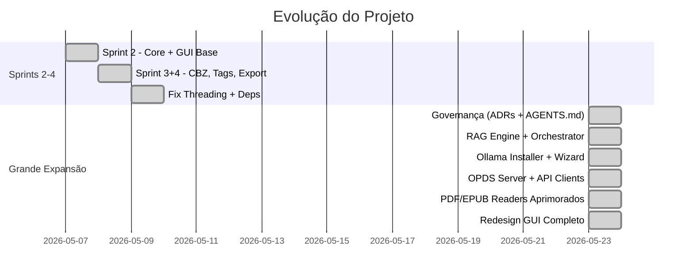

# Relatório Resumido de Alterações — Biblioteca Pessoal

> **Data**: 23 de Maio de 2026  
> **Período coberto**: 07/Mai/2026 → 23/Mai/2026  
> **Commits analisados**: 10 (desde o Initial Commit)  
> **Estado atual**: sem alterações não-commitadas

---

## Timeline dos Commits

| # | Hash | Data | Descrição |
|---|------|------|-----------|
| 1 | `19e4a59` | — | Initial commit |
| 2 | `6d32e6a` | 07/Mai | Sprint 2 — Busca in-document, tela cheia, estrelas, estatísticas, importação |
| 3 | `5360da0` | 08/Mai | Sprint 3+4 — CBZ reader, tags, coleções, watcher, export |
| 4 | `7b08df4` | 09/Mai | Fix — Threading SQLite, ebooklib, PDF cover |
| 5 | `baf3030` | 23/Mai | Chore — .gitignore atualizado |
| 6 | `0525d4c` | 23/Mai | Chore — Infraestrutura de governança de agentes (ADRs) |
| 7 | `183bdea` | 23/Mai | **Feat** — RAG Engine + Orquestrador Agentic + Policy Engine |
| 8 | `597ffd1` | 23/Mai | **Feat** — Instalador Ollama + Setup Wizard |
| 9 | `f1da510` | 23/Mai | **Feat** — Servidor OPDS + API Clients + Network Utils |
| 10 | `26024ce` | 23/Mai | **Feat** — PDF/EPUB Readers aprimorados + Schema estendido |
| 11 | `92c4000` | 23/Mai | **Feat** — Redesign GUI: RAG Panel, Reader, Styles (**HEAD**) |

---

## Estatísticas Gerais

| Métrica | Valor |
|---------|-------|
| Total de arquivos criados/modificados | **~100 arquivos** |
| Linhas adicionadas (total) | **~16.000+** |
| Testes adicionados | **~15 arquivos de teste** |
| ADRs criados | 6 |
| Novas ferramentas RAG | 4 (vector_search, keyword_search, search_web, highlight) |

---

## Detalhamento por Componente

### 🧠 Core — Motor de IA (Agentic RAG)
**Commit**: [`183bdea`] — `+3.245 linhas`

Arquivos principais:
- [rag_engine.py](file:///g:/PROGRAMAS%20PYTHON/Biblioteca-pessoal/src/core/rag_engine.py) — Pipeline completo de RAG com **1.262 linhas**: indexação ChromaDB, embeddings via Ollama (`nomic-embed-text`), Function Calling em loop iterativo (até 5 rodadas), fallback de endpoints de embeddings, streaming de tokens.
- [orchestrator.py](file:///g:/PROGRAMAS%20PYTHON/Biblioteca-pessoal/src/core/rag/orchestrator.py) — Orquestrador agentic com **778 linhas**: gerenciamento de estado do agente, resolução de ferramentas, controle de rodadas.
- [policy_engine.py](file:///g:/PROGRAMAS%20PYTHON/Biblioteca-pessoal/src/core/rag/policy_engine.py) — Motor de políticas para validação de mutações na UI.
- [web_search.py](file:///g:/PROGRAMAS%20PYTHON/Biblioteca-pessoal/src/core/rag/tools/web_search.py) — Ferramenta de pesquisa web via DuckDuckGo.

> [!IMPORTANT]
> Este é o componente mais crítico do projeto. Introduz capacidades de IA autônoma local (sem API keys externas).

---

### 🖥️ GUI — Redesign Completo
**Commit**: [`92c4000`] — `+3.881 linhas / -176 linhas`

| Arquivo | Mudança |
|---------|---------|
| [rag_panel.py](file:///g:/PROGRAMAS%20PYTHON/Biblioteca-pessoal/src/gui/widgets/rag_panel.py) | **[NEW]** Painel de chat side-by-side com IA — 862 linhas |
| [rag_worker.py](file:///g:/PROGRAMAS%20PYTHON/Biblioteca-pessoal/src/gui/workers/rag_worker.py) | **[NEW]** QThread para processamento assíncrono de IA — 236 linhas |
| [styles.py](file:///g:/PROGRAMAS%20PYTHON/Biblioteca-pessoal/src/gui/styles.py) | Overhaul completo das folhas de estilo — +570 linhas |
| [reader_view.py](file:///g:/PROGRAMAS%20PYTHON/Biblioteca-pessoal/src/gui/reader_view.py) | Leitor aprimorado: zoom, spread view, marca-texto — +706 linhas |
| [main_window.py](file:///g:/PROGRAMAS%20PYTHON/Biblioteca-pessoal/src/gui/main_window.py) | Reestruturação da janela principal — +569 linhas |
| [library_view.py](file:///g:/PROGRAMAS%20PYTHON/Biblioteca-pessoal/src/gui/library_view.py) | Grid de biblioteca aprimorado — +221 linhas |
| [annotation_panel.py](file:///g:/PROGRAMAS%20PYTHON/Biblioteca-pessoal/src/gui/widgets/annotation_panel.py) | Painel de anotações refinado — +294 linhas |
| [book_card.py](file:///g:/PROGRAMAS%20PYTHON/Biblioteca-pessoal/src/gui/widgets/book_card.py) | Cards de livro redesenhados — +108 linhas |
| [metadata_worker.py](file:///g:/PROGRAMAS%20PYTHON/Biblioteca-pessoal/src/gui/workers/metadata_worker.py) | **[NEW]** Worker para metadados — 40 linhas |

---

### 📡 Rede — OPDS + API Clients
**Commit**: [`f1da510`] — `+384 linhas`

- [opds_server.py](file:///g:/PROGRAMAS%20PYTHON/Biblioteca-pessoal/src/core/opds_server.py) — Servidor OPDS local para servir o catálogo via rede.
- [api_clients.py](file:///g:/PROGRAMAS%20PYTHON/Biblioteca-pessoal/src/core/api_clients.py) — Clientes de API para integração com serviços externos.
- [network.py](file:///g:/PROGRAMAS%20PYTHON/Biblioteca-pessoal/src/utils/network.py) — Utilitários de rede.
- [opds_worker.py](file:///g:/PROGRAMAS%20PYTHON/Biblioteca-pessoal/src/gui/workers/opds_worker.py) — Worker assíncrono para OPDS.

---

### 🔧 Instalador Ollama
**Commit**: [`597ffd1`] — `+692 linhas`

- [ollama_installer.py](file:///g:/PROGRAMAS%20PYTHON/Biblioteca-pessoal/src/core/ollama_installer.py) — Download e instalação automatizada do Ollama.
- [ollama_wizard.py](file:///g:/PROGRAMAS%20PYTHON/Biblioteca-pessoal/src/gui/dialogs/ollama_wizard.py) — Wizard de setup guiado com **301 linhas**.

---

### 📖 Leitores — PDF/EPUB Aprimorados
**Commit**: [`26024ce`] — `+199 linhas`

- [pdf_reader.py](file:///g:/PROGRAMAS%20PYTHON/Biblioteca-pessoal/src/readers/pdf_reader.py) — Marca-texto geométrico, renderização efêmera em memória, zoom e spread view.
- [epub_reader.py](file:///g:/PROGRAMAS%20PYTHON/Biblioteca-pessoal/src/readers/epub_reader.py) — Melhorias no parsing e renderização.
- [database.py](file:///g:/PROGRAMAS%20PYTHON/Biblioteca-pessoal/src/core/database.py) — Schema estendido para novas colunas.

---

### 🛡️ Governança de Agentes
**Commit**: [`0525d4c`] — `+693 linhas`

| Artefato | Descrição |
|----------|-----------|
| ADR-001 | Contrato uniforme `ToolOutput` |
| ADR-002 | Estado explícito do agente |
| ADR-003 | Policy Engine para mutações UI |
| ADR-004 | Logger de trace do agente |
| ADR-005 | Estratégia de falha e fallbacks |
| ADR-006 | Fronteira GUI ↔ Core AI |
| [AGENTS.md](file:///g:/PROGRAMAS%20PYTHON/Biblioteca-pessoal/AGENTS.md) | Regras de governança (78 linhas) |
| Scripts | `safety_gate.py`, `run_automated_tests.py`, `session_summary.py` |

---

### 🐛 Correções (Sprint anterior)
**Commit**: [`7b08df4`] — 09/Mai

- **Threading SQLite**: Resolvido deadlock na importação de livros com uso correto de conexões por thread.
- **Dependência ebooklib**: Adicionada ao `requirements.txt`.
- **Capas de PDF**: Corrigida geração de thumbnails para a biblioteca.

---

## Resumo Visual da Evolução

---

## ⚠️ Riscos e Observações

> [!WARNING]
> - **Testes não foram executados** neste relatório. É recomendado rodar `python -m pytest tests/` para validar o estado atual.
> - Os 7 commits de 23/Mai foram todos commitados em sequência rápida (~1 min entre cada), o que sugere um batch de trabalho acumulado. Verificar se todos os componentes se integram corretamente.

> [!NOTE]
> - O projeto não possui alterações não-commitadas (working tree limpa).
> - O `project_report.md` existente no repositório já documenta a arquitetura em detalhe; este relatório foca nas **mudanças incrementais**.

---

## Próximos Passos Sugeridos

1. **Validação**: Rodar a suíte de testes completa para verificar integridade
2. **Integração**: Testar o fluxo ponta-a-ponta do RAG Panel com Ollama em execução
3. **OPDS**: Validar servidor OPDS com um cliente real (ex: KOReader, Moon+ Reader)
4. **Roadmap pendente** (do `project_report.md`):
   - `[ ]` OCR Nativo Local (Tesseract/EasyOCR)
   - `[ ]` Multimodalidade para diagramas e imagens
   - `[ ]` Sincronização multi-dispositivo
   - `[ ]` Tradução offline (mBART/NLLB-200)
   - `[ ]` Flashcards gamificados (Anki)
