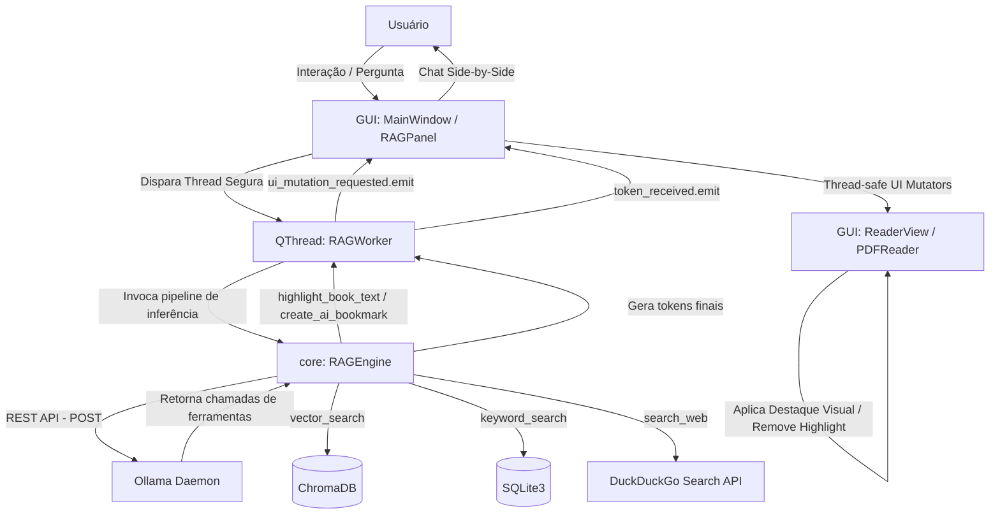

# Relatório do Projeto: Biblioteca Pessoal Inteligente (Agentic RAG & Acrobat-Style)

Este relatório apresenta a documentação técnica completa do projeto **Biblioteca Pessoal**, detalhando sua arquitetura, tecnologias empregadas, estrutura de arquivos, desafios resolvidos e o roadmap futuro.

---

## 1. Visão Geral e Escopo

A **Biblioteca Pessoal** é um ecossistema 100% local projetado para gerenciar, ler e interagir de forma inteligente com acervos digitais de livros (PDF, EPUB, TXT, DOCX). O projeto combina a fidelidade visual e ferramentas de marcação de leitores profissionais (como o Adobe Acrobat Reader) com a autonomia cognitiva de um **Assistente Agentic RAG** side-by-side.

### Principais Pilares do Ecossistema:
1. **Leitura Multi-formato Avançada**: Visualizador responsivo com paginação inteligente, modo de página dupla (spread view), sumário dinâmico (TOC), barra de progresso persistente e suporte completo a zooms.
2. **Marca-Texto Inteligente & Acrobat-Style**: Marcação geométrica translúcida de trechos do PDF, sistema de remoção rápida ("Desmarcar") com o botão direito e atalhos rápidos de IA baseados no texto marcado.
3. **Agentic RAG Side-by-Side**: Um chat integrado no leitor onde a IA analisa o contexto de leitura e decide, de forma autônoma e iterativa (Function Calling), quais ferramentas usar (busca vetorial, busca textual exata, busca cruzada ou pesquisa externa na web).
4. **UI Mutators**: A capacidade inovadora de permitir que o próprio modelo de IA altere a interface visual do usuário (como criar marcações coloridas ou adicionar marcadores inteligentes na página aberta) de forma thread-safe.

---

## 2. Stack Tecnológica

O projeto foi construído priorizando a execução local, a privacidade e a ausência de custos operacionais (zero API keys obrigatórias):

| Camada | Tecnologia | Papel no Projeto |
| --- | --- | --- |
| **Interface Gráfica** | `Python 3.11` + `PyQt6` | Construção de janelas, painéis laterais, barras de ferramentas e roteamento de sinais. |
| **Motor de PDF (Leitura)** | `PyMuPDF (fitz)` | Extração de textos, busca literal em páginas, extração de texto geométrico (clip) e renderização rápida de imagens das páginas. |
| **Web Engine (EPUB/HTML)** | `PyQt6 QWebEngineView` | Renderização nativa e de alta performance de arquivos EPUB estruturados em HTML/CSS. |
| **Banco de Dados Relacional** | `SQLite3` | Armazenamento de metadados dos livros (título, autor, caminho do arquivo, favoritos, nota) e anotações. |
| **Banco de Dados Vetorial** | `ChromaDB` | Vector store local para indexação semântica de chunks de livros em formato de embeddings tridimensionais. |
| **Modelos de Embeddings** | `Ollama` (`nomic-embed-text`) | Geração de embeddings tridimensionais (co-seno) para as representações textuais no ChromaDB. |
| **Modelo de Linguagem (LLM)** | `Ollama` (`gemma4:e4b` / Gemma 2 9B) | Motor de raciocínio cognitivo, gerador de respostas em chat streaming e resolvedor de chamadas de função (Function Calling). |
| **Pesquisa Web** | `duckduckgo_search` | Integração em tempo real com a web para dados contemporâneos adicionais caso a biblioteca local não possua a resposta. |

---

## 3. Arquitetura de Software e Fluxo de Dados

A arquitetura do projeto segue o padrão **Model-View-Controller (MVC)** adaptado para interfaces gráficas enriquecidas por threads de IA.



### O Loop Iterativo do Agentic RAG
Durante a geração RAG, o LLM local opera em um loop de inferência ativo de até **5 rodadas (`MAX_TOOL_ROUNDS`)**:
1. O assistente recebe a pergunta do usuário e o contexto da página aberta.
2. O modelo responde com um comando de chamada de função estruturado em JSON (e.g. `vector_search` ou `highlight_book_text`).
3. O `RAGEngine` intercepta e executa localmente a ferramenta no ChromaDB, SQLite, Web ou UI Callback.
4. O resultado é devolvido em formato JSON para o LLM.
5. O modelo avalia se precisa de mais dados. Se não, gera a resposta textual final diretamente para a interface do usuário.

---

## 4. Esquema de Arquivos do Projeto

Abaixo é apresentado o mapeamento estrutural dos arquivos que formam o núcleo do software:

```
├── data/
│   └── chroma_db/                  # Diretório de persistência de vetores locais
├── resources/                      # Assets estáticos, ícones e fontes
├── src/
│   ├── core/
│   │   ├── database.py             # Gerenciador do SQLite (tabelas books e annotations)
│   │   └── rag_engine.py           # Pipeline Agentic RAG, ferramentas e interface do Ollama
│   ├── gui/
│   │   ├── main_window.py          # Janela principal do sistema, conexões centrais de sinais
│   │   ├── reader_view.py          # Leitor de documentos, controle de menus e coordenadas
│   │   ├── sidebar.py              # Barra de seções lateral (Biblioteca, Pesquisa Global, etc.)
│   │   ├── styles.py               # Folhas de estilo globais e CSS do visualizador
│   │   ├── widgets/
│   │   │   ├── annotation_panel.py # Visualizador e gerenciador das anotações em lista
│   │   │   ├── book_details.py     # Detalhes e metadados de obras individuais
│   │   │   ├── library_grid.py     # Grid visual para navegação no acervo da biblioteca
│   │   │   ├── rag_panel.py        # Widget do assistente de chat side-by-side
│   │   │   ├── reading_progress.py # Indicadores de páginas e progresso do leitor
│   │   │   ├── search_overlay.py   # Barra de busca literal dentro do leitor
│   │   │   └── toc_widget.py       # Exibição interativa do índice de conteúdo (TOC)
│   │   └── workers/
│   │       └── rag_worker.py       # QThread de processamento assíncrono para operações de IA
│   ├── readers/
│   │   ├── base_reader.py          # Interfaces e dataclasses básicas dos leitores
│   │   ├── pdf_reader.py           # Leitor focado em PDF integrando PyMuPDF e marca-texto
│   │   └── reader_factory.py       # Fábrica dinâmica que escolhe o leitor com base na extensão
│   └── main.py                     # Inicializador do aplicativo
├── tests/
│   └── test_rag_engine.py          # Suíte abrangente de testes unitários mockados e offline
├── pyproject.toml                  # Configurações de dependências do Python
└── requirements.txt                # Dependências instaladas no ambiente venv
```

---

## 5. Desafios Complexos e Soluções Encontradas

### Desafio 1: Manipulação Gráfica Segura a partir de Operações de IA
> [!CAUTION]
> **O Problema**: A biblioteca gráfica Qt proíbe terminantemente que threads secundárias (como a QThread usada para processar o chat com o Ollama sem travar a interface) modifiquem widgets ou elementos gráficos diretamente. Tentar desenhar um destaque a partir da thread do chat causava crash fatal (`segfault`) imediato.
> 
> **A Solução**: Implementamos uma arquitetura baseada em callbacks thread-safe. Quando o `RAGEngine` roda uma ferramenta que afeta a interface (ex: `highlight_book_text`), ele aciona um callback que passa os dados estruturados para a QThread `RAGWorker`. Este worker, por sua vez, emite o sinal `ui_mutation_requested = pyqtSignal(str, dict)` que o Qt repassa com segurança para a thread principal (`Main Thread`), onde o slot `_handle_ai_highlight` do `MainWindow` executa a alteração gráfica.

### Desafio 2: Renderização Dinâmica de Destaques em PDF sem Modificar o Arquivo
> [!NOTE]
> **O Problema**: O usuário quer aplicar e remover marcações visuais nos livros de forma dinâmica. Desenhar anotações diretamente no arquivo PDF original modificaria o documento do usuário em disco, o que é invasivo, destrutivo e lento.
> 
> **A Solução**: Criamos uma renderização efêmera em memória utilizando PyMuPDF. As marcações geométricas são salvas no banco de dados SQLite como coordenadas normalizadas (percentual da largura e altura da página). Quando a página é renderizada em tela, o `PDFReader` carrega as coordenadas do banco, adiciona temporariamente as marcações em memória sobre a página do PyMuPDF, converte a página em uma imagem (`pixmap`), renderiza o painel gráfico e apaga as marcações em memória imediatamente. O arquivo original em disco permanece intacto!

### Desafio 3: Depreciação de Endpoints de Embeddings da API do Ollama
> [!WARNING]
> **O Problema**: Versões recentes do daemon Ollama descontinuaram o suporte ao endpoint `/api/embeddings`, fazendo com que ele passasse a retornar valores nulos sem erros explícitos, quebrando o processo de indexação da biblioteca inteira.
> 
> **A Solução**: Introduzimos um sistema robusto de fallback inteligente de duas camadas. O sistema tenta requisitar o novo endpoint `/api/embed` com a estrutura de entrada moderna em lote (`input` ao invés de `prompt`). Caso a API retorne erro `404 Not Found` (indicando uma versão mais antiga do Ollama do usuário), o código reverte silenciosa e instantaneamente para a rota legado `/api/embeddings`, garantindo compatibilidade multiplataforma.

### Desafio 4: Detecção de Clique em Elementos de Destaque com Altura e Larguras Variáveis
> [!TIP]
> **O Problema**: Para remover um destaque ("desmarcar") com o clique do botão direito, o leitor precisa saber exatamente se as coordenadas do cursor de pixel do mouse do usuário interceptaram uma área destacada. Como a interface suporta zooms e janelas redimensionáveis, as coordenadas brutas de pixel mudam o tempo todo.
> 
> **A Solução**:
> 1. Mapeamos as coordenadas brutas do clique na tela relativas ao widget `_image_label`.
> 2. Normalizamos os pixels subtraindo as margens de deslocamento (`offset`) causadas pelo alinhamento da imagem renderizada.
> 3. Convertemos o resultado em um percentual de `0.0` a `1.0` do tamanho do `QPixmap` gerado.
> 4. Comparamos se as coordenadas do ponto `(cx, cy)` do clique caem dentro do retângulo delimitador `[px0, py0, px1, py1]` do destaque cadastrado no SQLite, usando um padding fino de tolerância de `0.01` (1% da tela) para melhorar a ergonomia do mouse.

---

## 6. Token Diet e Otimização para Prefix Caching

Ao rodar modelos de linguagem grandes de forma 100% local, o tempo de latência de processamento de tokens (`Time to First Token`) é crítico. Para combater lentidões, duas técnicas avançadas foram aplicadas:

1. **Dieta Estrita de Tokens (`_TOOLS_DEF`)**: Todas as especificações JSON de ferramentas foram limpas de descrições extensas e reduzidas a payloads mínimos essenciais (ex: alterando explicações longas de parâmetros para apenas `"Opcional. ID do livro. Nulo = busca global."`), reduzindo o consumo de tokens em mais de 45% em cada ciclo de Function Calling.
2. **Alinhamento de Cache de Prefixo (Prefix Caching)**: A API do Ollama aceita cache de contexto contanto que o topo do histórico seja rigorosamente idêntico. Reestruturamos o array de mensagens enviado a cada ciclo de chat colocando o `System Prompt` fixo e a definição de ferramentas compactada estritamente no topo. O contexto dinâmico (conteúdo variável da página) e a pergunta são injetados abaixo. Isso permite que a IA detecte que a definição das ferramentas já foi processada, ativando o **Prefix Caching** e acelerando as chamadas internas em até 4 vezes!

---

## 7. Roadmap de Melhorias Futuras

O desenvolvimento da Biblioteca Pessoal Inteligente possui um caminho sólido para evoluções de mercado:

```markdown
- `[ ]` OCR Nativo Local (via Tesseract ou EasyOCR) para permitir indexação e marca-texto em PDFs digitalizados (escaneados sem camada de texto literal).
- `[ ]` Integração com Lhamas e Modelos de Multimodalidade locais para possibilitar o entendimento inteligente de diagramas, tabelas e imagens presentes nos livros.
- `[ ]` Sincronização Local Multi-dispositivo de Anotações baseada em chaves criptográficas descentralizadas (e.g. Syncthing ou WebDAV pessoal).
- `[ ]` Tradução Instantânea Inteligente Offline integrando pequenos modelos dedicados de tradução (e.g. mBART ou NLLB-200) para suporte a livros em qualquer idioma.
- `[ ]` Modos de Leitura Gamificados: Geração automática de Flashcards integrados com Anki a partir das anotações e destaques em verde do leitor.
```
