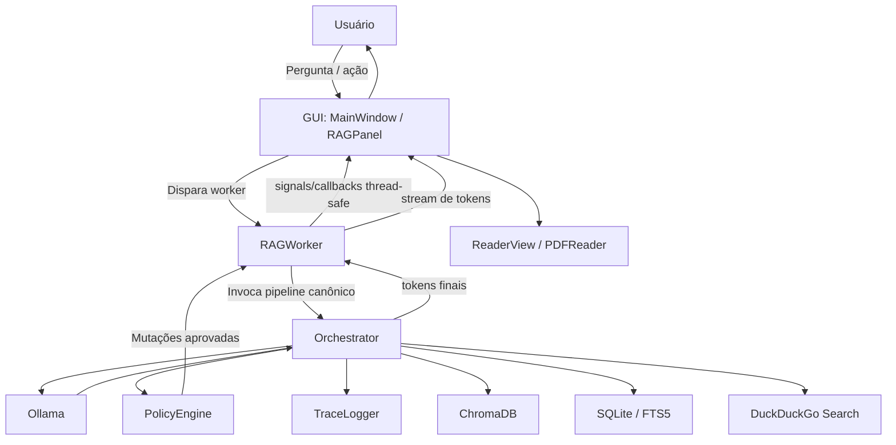

# Relatório do Projeto: Biblioteca Pessoal Inteligente  
## Local-First Reader + Agentic RAG + Acrobat-Style UI Mutators

Este relatório apresenta a documentação técnica consolidada do projeto **Biblioteca Pessoal**, detalhando seu escopo, arquitetura, tecnologias, estrutura resumida de arquivos, decisões arquiteturais, desafios resolvidos e roadmap futuro.

---

## 1. Visão Geral e Escopo

A **Biblioteca Pessoal** é um ecossistema **100% local-first** para gerenciamento, leitura e interação inteligente com acervos digitais de livros e documentos. O projeto combina:

- **fidelidade visual e ergonomia de leitores profissionais** (inspiração Acrobat-style),
- **leitura multi-formato local**,
- **anotações e destaques não destrutivos**,
- e um **Assistente Agentic RAG** integrado, capaz de consultar conteúdo local, cruzar referências e executar ações visuais seguras na interface.

A proposta central do sistema é permitir que o usuário **leia, busque, anote e converse com sua biblioteca** sem depender de serviços obrigatórios em nuvem, preservando privacidade, portabilidade e custo operacional zero para o fluxo principal.

### Estado Atual de Maturidade

O projeto encontra-se em um estágio de maturidade significativamente superior ao de um MVP tradicional:

- **Fase 1 concluída**: o caminho canônico do RAG foi consolidado em `src/core/rag/orchestrator.py`, com `src/core/rag_engine.py` mantido como facade compatível.
- **Fase 2 concluída**: foi implementado o **Structured Agent Trace Logger (ADR-004)**, com persistência local de traces em JSONL sob `data/traces/`.
- **Fase 3 concluída**: ferramentas operacionais criadas (Housekeeping/Retenção, Trace Inspector CLI e Evaluation Harness base).
- **Fase 4 concluída**: evolução da qualidade semântica com o novo `AgentState` (ADR-002), tracking avançado de `sources_used`, `repeated_result_count` e avaliação de sessões (redundantes, fallback-heavy, etc).
- O sistema opera com:
  - **Policy Engine ativo (ADR-003)**,
  - **boundary explícito entre GUI e Core AI (ADR-006)**,
  - **rastreabilidade e retenção estruturadas de execuções agentic**,
  - **classificação automática e avaliação estrutural (Eval Harness)**,
  - e **suíte de testes especializada** para os componentes críticos do pipeline RAG.

### Principais Pilares do Ecossistema

1. **Leitura Multi-formato Avançada**  
   Visualizador local com suporte a PDF, EPUB, DOCX, TXT/Markdown e outros formatos, com paginação, TOC, zoom, progresso persistente e ergonomia de leitura.

2. **Marca-Texto Inteligente & Acrobat-Style**  
   Sistema de destaques visuais efêmeros e anotações persistidas separadamente, sem alteração destrutiva do arquivo original em disco.

3. **Agentic RAG Side-by-Side**  
   Painel de assistente integrado ao leitor, capaz de executar busca vetorial, busca textual exata, referência cruzada e pesquisa web complementar, de forma iterativa e controlada.

4. **UI Mutators Seguros**  
   A IA pode solicitar mutações visuais seguras (como destaque e marcador inteligente), mas toda mutação passa por validação arquitetural e de policy antes de chegar à GUI.

5. **Observabilidade Estruturada**  
   Toda sessão relevante do pipeline agentic pode gerar **traces locais em JSONL**, permitindo auditoria, debugging e inspeção posterior do comportamento do sistema.

---

## 2. Stack Tecnológica

O projeto prioriza execução local, privacidade, transparência operacional e independência de serviços externos pagos.

| Camada | Tecnologia | Papel no Projeto |
| --- | --- | --- |
| **Linguagem / Runtime** | `Python 3.11+` | Base principal do sistema desktop e do pipeline de IA local |
| **Interface Gráfica** | `PyQt6` | Janelas, painéis, widgets, sinais e roteamento UI |
| **Web Engine** | `PyQt6 QWebEngineView` | Renderização de conteúdos HTML/EPUB |
| **Leitura de PDF** | `PyMuPDF (fitz)` | Renderização, busca em página, clipping de texto e manipulação geométrica |
| **Readers auxiliares** | `EbookLib`, `python-docx`, `markdown`, `BeautifulSoup` | Leitura e parsing de EPUB, DOCX, TXT/Markdown |
| **Banco Relacional** | `SQLite3` | Metadados, progresso de leitura, anotações, destaques, coleções, tags e índices auxiliares |
| **Busca Textual** | `SQLite FTS5` | Busca textual local de alta velocidade sobre títulos/autores/descrições e metadados |
| **Banco Vetorial** | `ChromaDB` | Persistência local de embeddings para busca semântica |
| **Embeddings** | `Ollama` + `nomic-embed-text` | Geração de embeddings vetoriais de alta dimensionalidade |
| **LLM Local** | `Ollama` + modelos configuráveis (`gemma4:e4b`, etc.) | Chat RAG, raciocínio iterativo e function calling |
| **Pesquisa Web** | `duckduckgo_search` | Fonte complementar opcional de conhecimento contemporâneo |
| **TTS Local** | `pyttsx3` | Leitura em voz offline |
| **Tracing Estruturado** | `JSONL` + stdlib Python | Auditoria local append-only de sessões agentic (ADR-004) |
| **Testes** | `pytest`, `pytest-qt`, `pytest-asyncio`, `pytest-cov` | Testes unitários, integração e UI |

---

## 3. Arquitetura de Software

A arquitetura atual do projeto é melhor descrita como uma **arquitetura em camadas orientada a eventos**, com separação explícita entre:

- **GUI (`src/gui/`)**
- **Workers assíncronos (`src/gui/workers/`)**
- **Core de negócio e IA (`src/core/`, `src/core/rag/`)**
- **Readers (`src/readers/`)**
- **Dados locais (`SQLite`, `ChromaDB`, `config.json`, `traces`)**

### Direção de Dependências

A direção arquitetural obrigatória é:

```text
GUI -> Workers -> Core AI/RAG -> Dados locais / serviços locais
```

Princípios centrais:

- O **Core AI/RAG não importa PyQt6**.
- A GUI nunca executa diretamente a lógica cognitiva do agente.
- Toda operação potencialmente pesada ou bloqueante é feita por **QThreads / Workers**.
- Toda mutação visual solicitada pela IA passa por:
  1. **Orchestrator**
  2. **PolicyEngine**
  3. **Worker**
  4. **Signal Qt**
  5. **Thread principal da GUI**

### Fluxo Arquitetural do RAG



---

## 4. Agentic RAG: Caminho Canônico e Ciclo de Execução

O sistema RAG opera hoje com **um único caminho canônico de execução**:

```text
src/core/rag/orchestrator.py
```

O módulo `src/core/rag_engine.py` permanece como **facade compatível**, delegando ao `Orchestrator` para preservar compatibilidade histórica e reduzir risco de regressão.

### Loop Iterativo do Agentic RAG

Durante uma consulta, o pipeline segue um ciclo controlado de múltiplas rodadas:

1. O usuário faz uma pergunta no painel do assistente.
2. O `RAGWorker` encaminha a consulta ao `Orchestrator`.
3. O `Orchestrator` monta o contexto inicial:
   - busca vetorial,
   - busca textual,
   - metadados,
   - contexto do livro/página atual,
   - histórico relevante da sessão.
4. O LLM local responde com:
   - texto final, ou
   - **chamadas de ferramenta (tool calls)**.
5. O `Orchestrator` executa a ferramenta adequada, por exemplo:
   - `vector_search`
   - `keyword_search`
   - `cross_reference`
   - `search_web`
   - `highlight_book_text`
   - `create_ai_bookmark`
6. Se a ação envolver mutação de UI:
   - ela é validada pelo **PolicyEngine**,
   - e só então é encaminhada de forma thread-safe para a GUI.
7. O resultado da ferramenta volta ao modelo como contexto adicional.
8. O loop continua até:
   - resposta final,
   - early-exit,
   - fallback,
   - ou limite de rodadas.

### Recursos de Controle

O pipeline agentic utiliza:

- **AgentState** para controlar estado de sessão, rounds, proveniência e sinais operacionais.
- **PolicyEngine (ADR-003)** para avaliar ações sensíveis de UI.
- **TraceLogger (ADR-004)** para registrar eventos estruturados.
- **Fallback chain** para degradar com segurança:
  - vetorial → textual → local-only
  - web → local
- **Early-exit** para evitar loops redundantes.

---

## 5. Observabilidade Estruturada (ADR-004)

A partir da Fase 2, toda execução relevante do pipeline RAG pode ser auditada por meio de **traces estruturados locais**.

### Características

- Persistência local em:
  ```text
  data/traces/trace_{session_id}.jsonl
  ```
- Formato:
  - **JSONL**
  - append-only
  - parseável linha a linha
- Implementação:
  - `src/core/rag/trace_logger.py`
- Comportamento:
  - **fail-safe**
  - falhas de escrita de trace **não derrubam a query**
- Truncamento:
  - payloads grandes são truncados/sanitizados para evitar excesso de I/O e vazamento de texto bruto desnecessário

### Eventos rastreados

O sistema pode registrar, entre outros:

- `query_started`
- `context_loaded`
- `tool_call_requested`
- `tool_call_completed`
- `policy_decision`
- `fallback_activated`
- `early_exit`
- `final_answer_started`
- `final_answer_completed`
- `error`
- `query_completed`

### Benefícios

- auditoria retroativa do comportamento agentic
- debugging sem depender de modo verboso no terminal
- rastreamento do impacto do `PolicyEngine`
- análise posterior de fallbacks, loops e decisões de ferramenta

---

## 6. Estrutura Resumida do Repositório

Abaixo está um mapa resumido dos módulos centrais do projeto. O repositório real contém mais arquivos auxiliares, testes e infraestrutura de governança do que os listados aqui.

```text
Biblioteca-pessoal/
├── AGENTS.md
├── README.md
├── project_report.md
├── pyproject.toml
├── requirements.txt
│
├── .agents/
│   ├── adr/                        # ADRs de arquitetura
│   ├── rules/                      # Rules do workspace / governança
│   ├── scripts/                    # Hooks e automações auxiliares
│   └── skills/                     # Skills de engenharia
│
├── data/
│   ├── config.json                 # Configuração persistida
│   ├── library.db                  # Banco principal SQLite
│   ├── chroma_db/                  # Persistência vetorial local
│   ├── traces/                     # Traces JSONL do Agentic RAG
│   └── covers/                     # Capas extraídas
│
├── src/
│   ├── core/
│   │   ├── config.py
│   │   ├── database.py
│   │   ├── library.py
│   │   ├── metadata.py
│   │   ├── search.py
│   │   ├── rag_engine.py           # Facade compatível
│   │   ├── opds_server.py
│   │   ├── audio/
│   │   │   ├── audio_reader_service.py
│   │   │   ├── text_chunker.py
│   │   │   ├── tts_backend.py
│   │   │   └── pyttsx3_backend.py
│   │   └── rag/
│   │       ├── orchestrator.py     # Caminho canônico do RAG
│   │       ├── agent_state.py
│   │       ├── policy_engine.py
│   │       ├── trace_logger.py
│   │       └── tools/
│   │           ├── base.py
│   │           └── web_search.py
│   │
│   ├── tools/                      # Ferramentas CLI e Operacionais
│   │   ├── trace_inspector.py      # Inspeção de traces no console
│   │   ├── trace_retention.py      # Housekeeping de traces (ex: top 100)
│   │   └── rag_eval_harness.py     # Classificação e avaliação semântica dos traces
│   │
│   ├── gui/
│   │   ├── main_window.py
│   │   ├── reader_view.py
│   │   ├── library_view.py
│   │   ├── book_details.py
│   │   ├── search_bar.py
│   │   ├── sidebar.py
│   │   ├── settings_dialog.py
│   │   ├── styles.py
│   │   ├── widgets/
│   │   │   ├── annotation_panel.py
│   │   │   ├── rag_panel.py
│   │   │   ├── reading_progress.py
│   │   │   ├── search_overlay.py
│   │   │   └── toc_widget.py
│   │   └── workers/
│   │       ├── rag_worker.py
│   │       ├── audio_worker.py
│   │       ├── metadata_worker.py
│   │       └── opds_worker.py
│   │
│   ├── readers/
│   │   ├── base_reader.py
│   │   ├── reader_factory.py
│   │   ├── pdf_reader.py
│   │   ├── epub_reader.py
│   │   ├── docx_reader.py
│   │   ├── txt_reader.py
│   │   ├── cbz_reader.py
│   │   └── mobi_reader.py
│   │
│   └── main.py
│
└── tests/
    ├── test_rag_engine.py
    ├── test_rag_orchestrator.py
    ├── test_rag_policy.py
    ├── test_rag_trace_logger.py
    ├── test_audio_reader_service.py
    ├── test_database.py
    └── ...                         # Demais testes do projeto
```

---

## 7. Governança e ADRs

O projeto adota **governança arquitetural explícita** por meio de:

- `AGENTS.md`
- `.agents/rules/*.md`
- `.agents/adr/*.md`
- scripts auxiliares para validação e automação de sessão

### ADRs mais relevantes já refletidos no estado atual

#### ADR-003 — Policy Engine for AI Actions
Toda mutação de UI solicitada pela IA deve passar por um mecanismo explícito de policy antes de ser executada.

#### ADR-004 — Structured Agent Trace Logger
Toda execução agentic crítica deve poder ser auditada por meio de eventos estruturados persistidos localmente.

#### ADR-006 — GUI / Core AI Boundary
O Core AI/RAG não pode importar PyQt6 nem módulos GUI. Toda comunicação deve ocorrer por callbacks, interfaces ou signals thread-safe.

---

## 8. Desafios Técnicos Relevantes e Soluções

### Desafio 1 — Mutações de UI solicitadas por IA sem quebrar o Qt
**Problema:** o Qt não permite que threads secundárias modifiquem a interface diretamente sem risco de crash.  

**Solução:** a mutação é solicitada pelo Core, validada pelo `PolicyEngine`, encaminhada ao `RAGWorker` e então emitida via `pyqtSignal` para a thread principal, onde a GUI executa a alteração com segurança.

---

### Desafio 2 — Destaques visuais em PDF sem modificar o arquivo original
**Problema:** gravar destaque diretamente no PDF em disco seria invasivo, lento e destrutivo.  

**Solução:** as marcações são persistidas separadamente (ex.: no SQLite) como coordenadas normalizadas, e renderizadas efemeramente em memória sobre a página no momento da visualização.

---

### Desafio 3 — Evolução dos endpoints de embeddings do Ollama
**Problema:** mudanças de endpoint ou comportamento entre versões do daemon Ollama podem quebrar o fluxo de embeddings sem erro claro.  

**Solução:** o sistema utiliza estratégia de compatibilidade/fallback para lidar com variações de endpoint entre versões do Ollama.

---

### Desafio 4 — Detecção precisa de clique em destaque com zoom e redimensionamento
**Problema:** o clique do mouse precisa ser reconciliado com coordenadas geométricas persistidas, independentemente de zoom ou escala.  

**Solução:** o sistema transforma coordenadas visuais em percentuais normalizados do conteúdo renderizado e compara com bounding boxes persistidas.

---

### Desafio 5 — Consolidar o RAG e eliminar duplicidade de caminhos
**Problema:** o sistema possuía caminhos paralelos de execução para `query_rag`, o que gerava inconsistência arquitetural e risco de bypass de policy.  

**Solução (Fase 1):**
- consolidação do caminho canônico em `Orchestrator`
- `RAGEngine` mantido como facade compatível
- simplificação do `RAGWorker`
- testes de regressão específicos para ADR-003

---

### Desafio 6 — Falta de rastreabilidade do comportamento agentic
**Problema:** sem trilha estruturada, fallbacks, decisões de tool calling e bloqueios de policy eram difíceis de auditar.  

**Solução (Fase 2):**
- implementação do `TraceLogger`
- persistência local em JSONL
- `session_id` por execução
- eventos estruturados para query, tool calls, policy, fallback e finalização

---

### Desafio 7 — Integridade de Indexação e Refatoração da Ingestão
**Problema:** A lógica pesada de chunking, OCR fallback, e geração de embeddings estava acoplada ao `rag_engine.py`, e falhas de indexação podiam deixar o estado do livro ambíguo entre o SQLite e o ChromaDB.

**Solução (Fase 6):**
- migração do pipeline de ingestão para um novo `DocumentIndexerService`
- introdução da tabela `indexing_state` no SQLite (`pending`, `ok`, `failed`)
- utilitário de verificação e reparo (`index_reconcile`)
- simplificação do `rag_engine.py` para atuar apenas como facade para busca semântica.

---

### Desafio 8 — Corrupção do SQLite e Condições de Corrida (SQLite Hardening)
**Problema:** Condições de corrida na escrita concorrente no SQLite (ex: thread de background atualizando progresso e thread principal salvando notas) geravam erro de `DatabaseError: malformed`.

**Solução (Fase 6.1):**
- adoção de arquitetura *single-writer* com um `threading.Lock()` global para escritas
- gerenciamento estrito de isolamento de leitura/conexão via `threading.local()`
- garantia de persistência do *WAL mode* e sincronia segura.
- bateria massiva de testes para concorrência aprovada.

---

## 9. Otimizações de Performance e Economia de Tokens

Ao operar LLMs locais, especialmente com function calling iterativo, reduzir custo de contexto é essencial.

### 1. Token Diet das ferramentas
As definições de ferramentas (`_TOOLS_DEF`) foram compactadas para reduzir custo de contexto, mantendo apenas o essencial para a chamada correta.

### 2. Prefix Caching
O topo do histórico enviado ao modelo foi reestruturado para manter partes estáveis (System Prompt e definição de ferramentas) no prefixo, aproveitando melhor o cache de contexto sempre que suportado pela stack local.

### 3. Degradação controlada
Quando partes mais caras do pipeline falham (ex.: embeddings, busca web), o sistema degrada com segurança e continua respondendo no melhor modo possível.

---

## 10. Subsistemas Complementares Existentes

Além do núcleo Reader + RAG, o projeto já incorpora ou possui base funcional para:

- **Audio Reader offline**  
  Leitura em voz local com chunking e backend TTS offline.

- **OPDS Server local**  
  Exposição local do acervo em formato adequado para integração futura com clientes externos.

- **Infraestrutura de governança para agentes**  
  Rules, ADRs, scripts e skills em `.agents/`.

- **Teste especializado do pipeline crítico**  
  Cobertura dedicada para:
  - RAG facade
  - Orchestrator
  - PolicyEngine
  - TraceLogger
  - serviços de áudio
  - banco / busca

- **Persistência de traces para auditoria local**  
  Sem dependência de serviços externos, APMs ou telemetria remota.

---

## 11. Roadmap de Melhorias Futuras

O projeto possui um caminho claro de evolução técnica e de produto:

```markdown
- [x] OCR local para PDFs escaneados (Tesseract) (concluído na Fase 5)
- [ ] Melhor suporte multimodal local para diagramas, imagens e tabelas
- [ ] Sincronização local/multi-dispositivo de anotações
- [x] Tradução offline de trechos selecionados (Fase 8: NLLB-200, escopo em MVC restrito a blocos curtos <= 2000 chars. **Nota:** Exige internet na primeira execução para o bootstrap/download do modelo; subsequentes 100% offline).
- [ ] Geração de flashcards / integração com Anki
- [x] Política de retenção/rotação para `data/traces/` (concluído na Fase 3)
- [x] Ferramentas locais de inspeção e consulta de traces por `session_id` (concluído na Fase 3 e 4)
- [x] Evolução do `AgentState` para maior aderência ao ADR-002 e métricas de loop (concluído na Fase 4)
- [x] Criação de um RAG Evaluation Harness para inspecionar qualidade semântica e operacional de traces
- [ ] Refinamento da UI do leitor com base no plano de redesign já documentado
```

---

## 12. Resumo Executivo Final

A **Biblioteca Pessoal Inteligente** já não é apenas um leitor de documentos com chat acoplado.  
Ela evoluiu para um **ecossistema local-first de leitura, anotação, recuperação semântica e interação agentic segura**, com:

- **reader multi-formato funcional**
- **RAG agentic consolidado em caminho canônico**
- **Policy Engine protegendo mutações de UI**
- **boundary GUI/Core governado por ADR**
- **trace logger estruturado para auditoria**
- **testes especializados para os componentes críticos**

Esse conjunto posiciona o projeto como uma base sólida para evoluções futuras em:
- IA local aplicada à leitura,
- assistentes cognitivos privados,
- ferramentas de estudo e anotação inteligentes,
- e sistemas agentic desktop com governança forte.

Em resumo, o projeto já apresenta características típicas de um sistema **engineering-driven**, com foco em:
- rastreabilidade,
- segurança,
- modularidade,
- performance local,
- e maturidade arquitetural progressiva.
